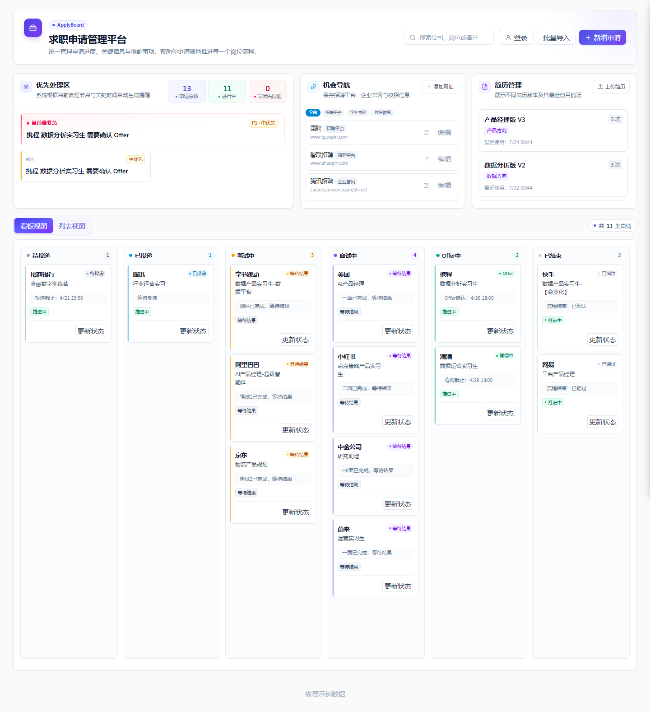
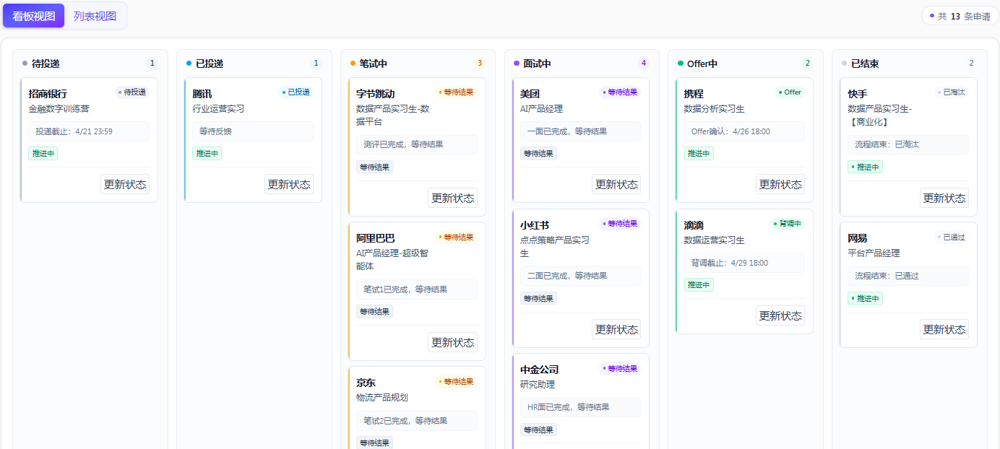

<div align="center">

# ApplyBoard

### 把找机会、选简历和跟进投递，放进同一张求职工作台

一款面向求职者的申请管理产品。<br>
不只记录「投了什么」，也帮你管理「去哪里找」「用哪份简历」「下一步做什么」。

[在线体验](https://applyboard.yingzhii.xyz/) · [功能亮点](#为什么是-applyboard) · [本地运行](#本地运行) · [反馈建议](https://github.com/kitty1219/Applyboard/issues)

[](https://applyboard.yingzhii.xyz/)
[](https://react.dev/)
[](https://www.typescriptlang.org/)
[](https://supabase.com/)
[](https://github.com/kitty1219/Applyboard/stargazers)

</div>



## 为什么做 ApplyBoard

一次完整的求职，远不只是维护一列公司名称：

- 招聘平台、企业官网和校招入口散落在浏览器收藏夹与聊天记录里；
- 同一份简历并不适合所有岗位，却很难记住每次投递使用了哪个版本；
- 测评、笔试、多轮面试、Offer 确认等节点交错，重要截止时间很容易遗漏；
- 表格能保存信息，却很难让人一眼看清「现在最该处理什么」。

ApplyBoard 因此把求职拆成三个连续动作：

> **发现机会 → 准备材料 → 推进申请**

它不是又一张投递记录表，而是一套围绕个人求职流程设计的工作台。

## 为什么是 ApplyBoard

### 1. 机会导航：把「去哪里找」也纳入管理

集中保存招聘平台、企业官网和校招信息，支持分类筛选、备注、编辑与快捷跳转。<br>
看到值得持续关注的招聘渠道时，不必再让它消失在收藏夹深处。

### 2. 简历管理：知道每个岗位该用哪一版

上传并管理不同方向、不同版本的简历，记录最近使用时间和使用次数；在申请记录中关联简历版本，减少错投、混投，也方便复盘不同版本的使用情况。

### 3. 求职看板：不只看状态，更要看下一步

用看板或列表统一管理全部申请。产品内置覆盖待投递、测评、笔试、多轮面试、Offer、背调及结束状态的 **14 个流程节点**，并把截止时间、面试时间和当前进度放回具体申请中。

### 4. 优先处理区：先处理真正紧急的事

系统根据申请状态与关键时间自动整理提醒，并区分申请总数、进行中和高优先级事项，让打开产品后的第一眼就能回答：

> **我今天最应该推进哪个机会？**


## 核心能力

| 模块 | 能力 |
| --- | --- |
| 申请管理 | 新增、编辑、删除申请，记录公司、岗位、JD、链接与简历版本 |
| 流程跟踪 | 14 节点状态流转，覆盖测评、笔试、多轮面试、Offer 与背调 |
| 双视图 | 看板把握全局，列表支持搜索、筛选、排序与批量导入 |
| 时间提醒 | 汇总投递截止、测评截止、笔试、面试与 Offer 确认等关键时间 |
| 机会导航 | 分类收藏招聘平台、企业官网、校招信息及自定义求职网址 |
| 简历管理 | 上传、预览、下载和删除简历，记录分类、备注与使用情况 |
| 账号与同步 | 邮箱注册登录、密码找回、云端保存与跨设备实时更新 |
| 数据安全 | 用户数据行级隔离，简历文件使用私有对象存储和临时签名链接 |
| 平滑迁移 | 登录后可将浏览器中的历史申请、简历和网址导入云端账号 |



## 现在就可以使用

打开 [applyboard.yingzhii.xyz](https://applyboard.yingzhii.xyz/) 即可体验：

- **无需登录**：直接使用示例数据浏览看板、列表、机会导航和简历管理；
- **注册账号**：保存自己的真实数据，并在不同设备之间同步；
- **已有本地数据**：登录时可选择一键导入云端，无需重新录入。

> 求职数据通常包含公司、岗位、面试时间和个人简历。ApplyBoard 使用 Supabase Row Level Security 隔离不同用户的数据，简历文件存放于私有 Storage Bucket。

## 技术架构

```text
React 19 + TypeScript + Vite
              │
              ├── Tailwind CSS：界面与响应式布局
              │
              └── Supabase
                   ├── Auth：注册、登录与密码恢复
                   ├── PostgreSQL：申请、简历与机会导航数据
                   ├── Realtime：跨设备数据更新
                   ├── Storage：私有简历文件
                   └── RLS：用户级数据隔离
```

## 本地运行

### 1. 获取项目

```bash
git clone https://github.com/kitty1219/Applyboard.git
cd Applyboard/frontend
npm install
```

### 2. 配置 Supabase

在 Supabase 创建项目，并依次执行仓库中的：

1. `../supabase/schema.sql`：创建数据表、RLS 策略和私有简历存储桶；
2. `../supabase/enable_realtime.sql`：开启多设备实时更新。

复制环境变量示例：

```bash
cp .env.example .env.local
```

填写你的 Supabase 配置：

```env
VITE_SUPABASE_URL=https://your-project.supabase.co
VITE_SUPABASE_PUBLISHABLE_KEY=sb_publishable_your_key
```

### 3. 启动开发环境

```bash
npm run dev
```

生产构建：

```bash
npm run build
```

## 产品仍在成长

ApplyBoard 来自真实的求职管理需求，也会继续围绕「更少遗漏、更快推进、更好复盘」迭代。

如果它对你有帮助：

- 给项目一个 **Star**，让更多正在求职的人看到它；
- 在 [Issues](https://github.com/kitty1219/Applyboard/issues) 分享你的使用反馈或功能建议；
- 如果你也在做求职工具，欢迎交流设计思路或提交改进。

<div align="center">

### 愿每一份认真准备的申请，都能被好好推进。

[体验 ApplyBoard](https://applyboard.yingzhii.xyz/) · [给一个 Star](https://github.com/kitty1219/Applyboard)

</div>
